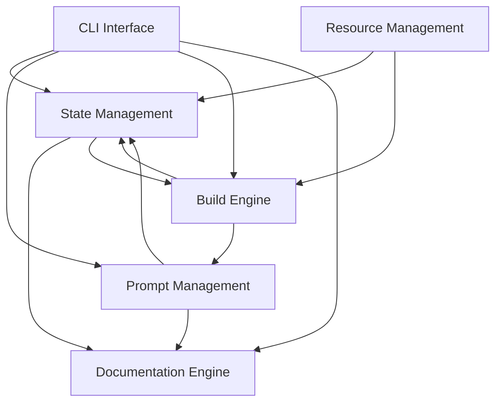

# System Integration

## Component Dependencies

### Dependency Graph


### Communication Patterns

#### Event-Based Communication
1. **State Changes**
   ```rust
   pub enum StateEvent {
       TaskCreated(TaskId),
       TaskUpdated(TaskId),
       TaskCompleted(TaskId),
       TaskFailed(TaskId, Error),
       DependencyResolved(TaskId),
       ResourceAllocated(TaskId, ResourceId),
       ResourceReleased(TaskId, ResourceId),
   }
   ```

2. **Build Events**
   ```rust
   pub enum BuildEvent {
       BuildStarted(BuildId),
       StepCompleted(BuildId, StepId),
       BuildCompleted(BuildId),
       BuildFailed(BuildId, Error),
       ResourceRequested(BuildId, ResourceRequest),
       ResourceGranted(BuildId, ResourceGrant),
   }
   ```

3. **Documentation Events**
   ```rust
   pub enum DocEvent {
       DocCreated(DocId),
       DocUpdated(DocId),
       ValidationFailed(DocId, Error),
   }
   ```

### Resource Sharing

#### Shared State Access
```rust
pub struct SharedState {
    pub state_manager: Arc<RwLock<StateManager>>,
    pub doc_engine: Arc<RwLock<DocumentationEngine>>,
    pub build_engine: Arc<RwLock<BuildEngine>>,
    pub resource_manager: Arc<RwLock<ResourceManager>>,
}
```

#### Resource Management
```rust
pub struct ResourceManager {
    pub allocations: Arc<RwLock<HashMap<ResourceId, ResourceAllocation>>>,
    pub limits: ResourceLimits,
    pub metrics: Arc<RwLock<ResourceMetrics>>,
}

pub struct ResourceLimits {
    pub max_concurrent_builds: usize,
    pub max_memory_per_build: usize,
    pub max_disk_space_per_build: usize,
    pub task_timeout: Duration,
    pub max_cpu_per_build: f64,
}

pub struct ResourceMetrics {
    pub cpu_usage: HashMap<TaskId, f64>,
    pub memory_usage: HashMap<TaskId, usize>,
    pub disk_usage: HashMap<TaskId, usize>,
    pub execution_time: HashMap<TaskId, Duration>,
}
```

### Resource Limits
- Max concurrent builds: 4
- Max memory per build: 1GB
- Max disk space per build: 10GB
- Task timeout: 30 minutes
- Max CPU per build: 2.0

## Error Handling

### Error Propagation
1. **Component-Level Errors**
   ```rust
   #[derive(Debug, Error)]
   pub enum SystemError {
       #[error("State error: {0}")]
       State(#[from] StateError),
       #[error("Build error: {0}")]
       Build(#[from] BuildError),
       #[error("Documentation error: {0}")]
       Doc(#[from] DocError),
       #[error("Prompt error: {0}")]
       Prompt(#[from] PromptError),
       #[error("Resource error: {0}")]
       Resource(#[from] ResourceError),
   }
   ```

2. **Error Context Chain**
   ```rust
   pub struct ErrorContext {
       pub component: ComponentId,
       pub operation: OperationType,
       pub timestamp: DateTime<Utc>,
       pub cause: Option<Box<ErrorContext>>,
       pub resource_state: Option<ResourceState>,
   }
   ```

### Recovery Strategies

#### State Recovery
1. **Snapshot-based Recovery**
   - Periodic state snapshots (every 5 minutes)
   - Resource allocation snapshots
   - Dependency state preservation

2. **Resource Recovery**
   - Automatic resource cleanup
   - Resource reallocation on failure
   - Priority-based resource redistribution

#### Dependency Resolution
1. **Deadlock Prevention**
   - Early cycle detection
   - Resource ordering
   - Timeout-based resolution

2. **Task Scheduling**
   - Resource-aware scheduling
   - Priority inheritance
   - Dynamic task reordering

## Logging Requirements

#### Log Levels
```rust
pub enum LogLevel {
    Error,   // System errors requiring immediate attention
    Warn,    // Potential issues that might need investigation
    Info,    // Normal system operation events
    Debug,   // Detailed information for debugging
    Trace,   // Very detailed debugging information
}
```

#### Required Log Fields
```rust
pub struct LogEntry {
    pub timestamp: DateTime<Utc>,
    pub level: LogLevel,
    pub component: ComponentId,
    pub operation: String,
    pub correlation_id: String,
    pub message: String,
    pub context: HashMap<String, Value>,
}
```

## Performance Requirements

### Response Times
- CLI commands: < 100ms
- Build initialization: < 500ms
- Task state updates: < 50ms
- Documentation updates: < 200ms

### Throughput
- Concurrent builds: 4+
- State operations: 1000/s
- Documentation operations: 100/s

### Resource Usage
- CPU: < 70% per core
- Memory: < 2GB base, < 8GB peak
- Disk I/O: < 100MB/s sustained
- Network: < 50MB/s per build

## Monitoring and Metrics

### System Metrics
```rust
pub struct SystemMetrics {
    pub active_builds: u32,
    pub pending_tasks: u32,
    pub state_size: usize,
    pub error_count: u32,
    pub resource_usage: ResourceMetrics,
}
```

### Component Metrics
```rust
pub struct ComponentMetrics {
    pub operations_total: u64,
    pub operations_failed: u64,
    pub average_latency: Duration,
    pub resource_usage: ResourceMetrics,
}
```

### Health Checks
1. Component liveness checks (every 30s)
2. Resource availability verification
3. State consistency validation
4. Connection pool health
